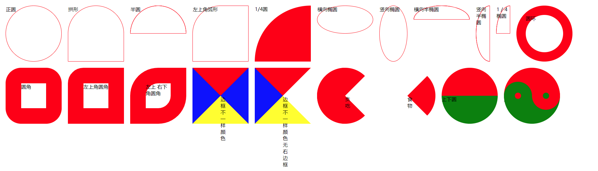

<!--
 * @Author       : HyFun
 * @Date         : 2021-07-07 17:26:19
 * @Description  : css 笔记
 * @LastEditors  : HyFun
 * @LastEditTime : 2021-07-07 19:16:23
-->

# CSS

## 1. css 特性

- 层叠性
- 继承性
- 优先级

## 2. css 优先级

`!important` > `内联样式` > `ID选择器(#id)` > `类选择器(.class)` =
`伪类选择器(:hover等)` = `属性选择器[type等]` > `元素选择器(p等)` =
`伪元素选择器(:after/:before/::selection等)` > `通用选择器(*)` > `继承的样式`

## 3. 文字换行、文字溢出

单行

```css
overflow: hidden;
text-overflow: ellipsis;
white-space: nowrap;
```

多行

```css
display: -webkit-box;
-webkit-box-orient: vertical;
-webkit-line-clamp: 3;
overflow: hidden;
```

## 4. 盒子模型

### 标准盒模型 + IE 盒模型


标准 W3C 盒子模型的范围包括: margin、border、padding、content，并且 content 部分不包含其他部分。


IE 盒子模型的范围也包括 margin、border、padding、content，和标准 W3C 盒子模型不同的是：IE 盒子模型的 content 部分包含了 border 和 pading。

### 通过 CSS 设置盒模型模式

```css
box-sizing: content-box; // 标准盒模型
box-sizing: border-box; // IE盒模型
```

### 获取盒子模型的宽高

```js
dom.style.width / height
dom.currentStyle.width / height // (ie支持)
window.getComputedStyle(dom).width / height
dom.getBoundingClientRect().width / height
```

## 5. 清除浮动

- 固定宽高
- overflow: hidden
- 隔墙法。在最后使用`.clearfix`
- 伪元素法
- 双伪元素

## 6. ``1px 留白解决

- 父级和`img`宽高写一样
- display：block
- float
- vertical-align：middle
- 父级：font-size：0
- 父级：line-height：0

## 7. background

- background-image
- background-color
- background-size
- background-position
- background-repeat
- background-origin
- background-clip

## 8. position 几种值

- static
- absolute
- relative
- fixed

## 9. 鼠标取值

- auto  输入框focus样式
- pointer  小手
- progress  等待loading
- not-allowed 不允许
- default 默认样式
- help 帮助


## 10. css3: border-radius



[相关css代码](../02 CSS/003 CSS进阶/002 通过css绘制各种形状.html)
