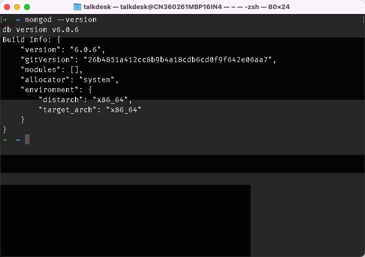

# Installation

## Mac OS

Use brew

> brew tap mongodb/brew

> brew install mongodb-community@6.0

Verify version

> mongod --version

Start service

> brew services start mongodb/brew/mongodb-community

Stop service

> brew services stop mongodb/brew/mongodb-community

# Getting Start

## Install Navicat

https://www.zanglikun.com/14865.html
