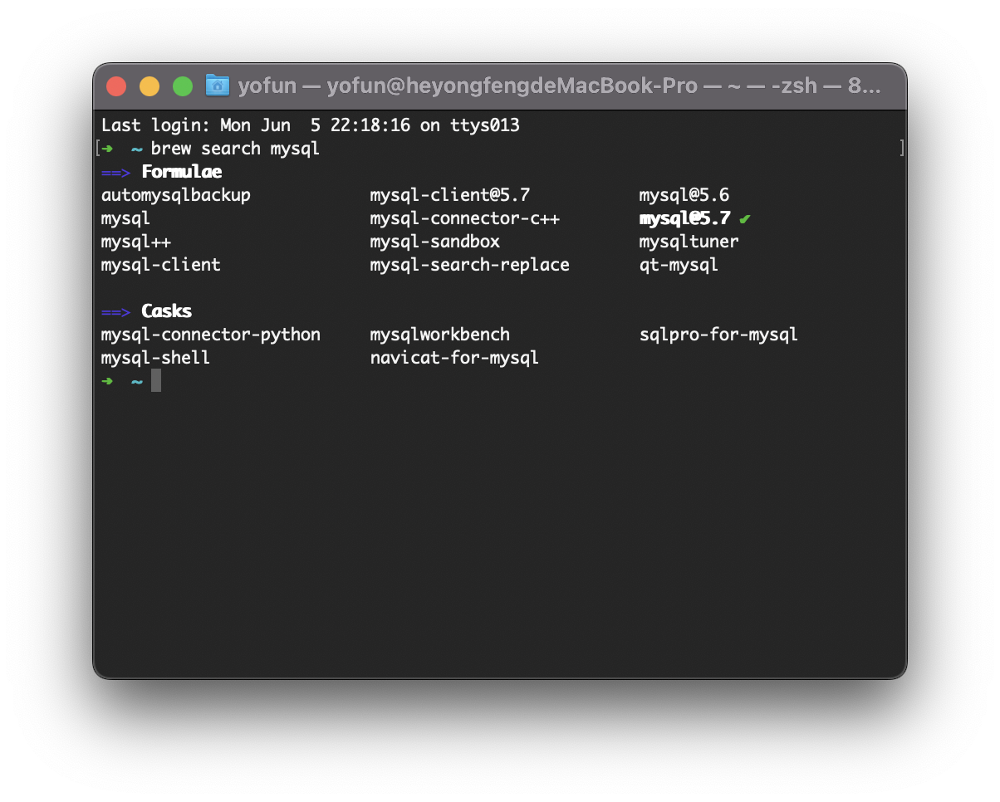

# MySQL on MacOS

## Installation

安装 mysql 使用的是 brew 来进行安装的，如果没有安装请先安装好

**1. 查询安装的 mysql**

> brew search mysql

**2. 安装mysql@5.7**

> brew install mysql@5.7

**3. 设置环境变量**

以 zsh 为例

> echo 'export PATH="/usr/local/opt/mysql@5.7/bin:$PATH"' >> ~/.zshrc

然后

> source ~/.zshrc

**4. 初始化配置**

安装完成后需要执行一次配置才能够正常使用，执行如下命令：

> mysql_secure_installation

- 是否开启密码校验插件

  

  如果是个人使用，这里可以`不开启密码校验插件`，这样我们可以使用较为简单的密码组合，方便记忆，因此输入**n**。

- 设置root用户密码

  

  为数据库的root用户（最高权限用户）设置密码，需要输入两次，输入时没有光标显示，是正常的。

- 选择是否移除用户

  

  这一步可以将不需要的匿名用户移除，输入y回车即可。

- 开启root用户远程连接

  

  默认给出的选项是不允许通过root用户远程连接，因为root用户拥有最高权限，学习阶段可以开启方便虚拟机或局域网调试（如果开启需要输入n）。

- 选择是否保留测试数据集

  

  安装是默认附带一个test数据集，这里可以根据需要选择是否保留（如果需要移除则输入y）。

- 立即刷新权限

  

  输入y使得密码和权限设置立即生效，否则需要重新启动数据库服务。

**5. 测试登录**

使用刚刚设置的密码测试登陆：

> mysql -uroot -p

也可以在命令中使用明文密码直接登陆，如（密码为root）：

> mysql -uroot -proot

## Navicat

- 以Navicat为例，首先新建一个连接：

  

- 填写连接名和密码创建一个新的连接：

  