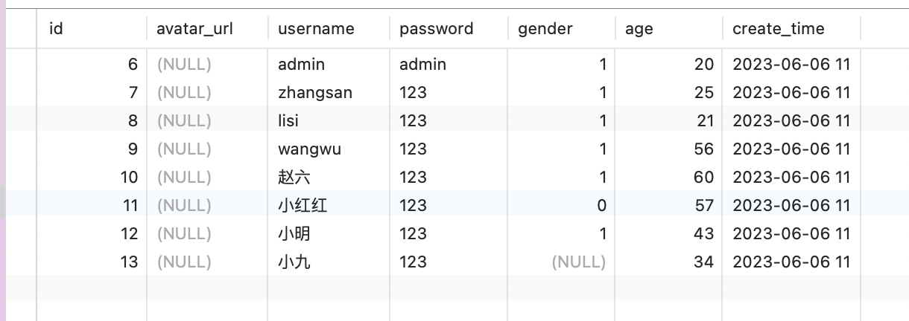
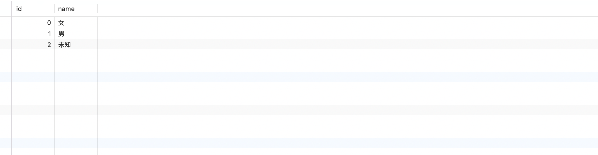
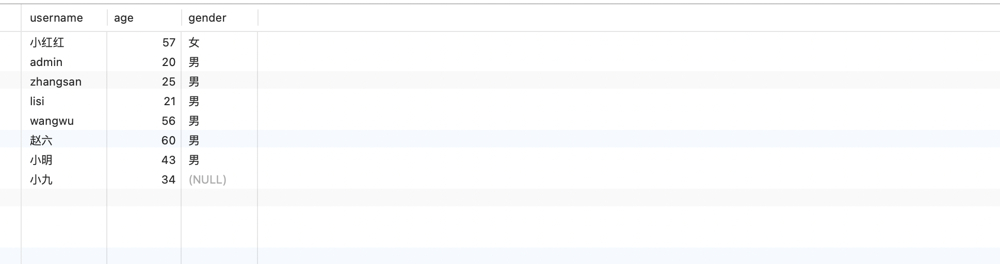
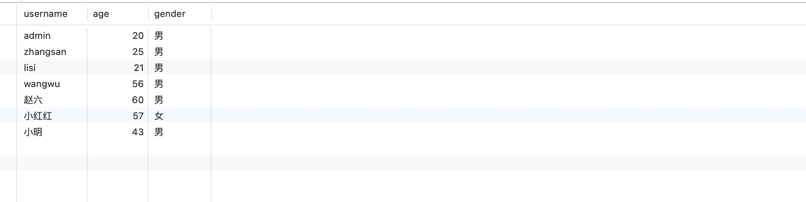
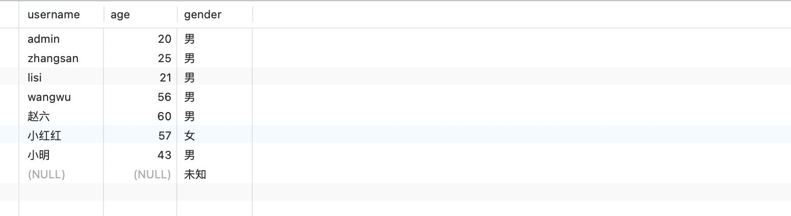
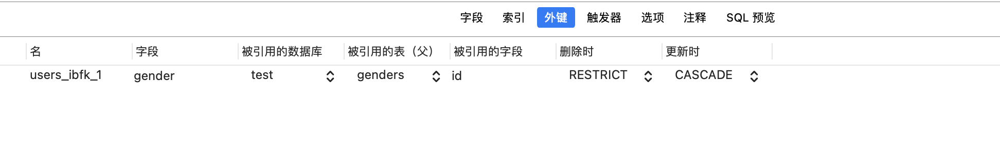

# Getting Start

## 新增数据

```mysql
INSERT INTO `users`(`username`, `password`, `age`, `gender`) VALUES ('小九', '123', 34, 0);
```

## 修改数据

```mysql
UPDATE `users` SET `age` = 57, `username` = '小红红' WHERE `username` = '小红'
```

## 删除数据

```mysql
DELETE FROM `users` WHERE `username` = '小十'
```

## 查询

- 查询所有

  > SELECT \* FROM `users`

- 条件查询

  > SELECT \* FROM `users` WHERE `age` >= 34

- 排序

  > SELECT \* FROM `users` WHERE `age` >= 34 ORDER BY `age`

- 倒序

  > SELECT \* FROM `users` WHERE `age` >= 34 ORDER BY `age` DESC

- 查询某些字段

  > SELECT `username`,`age` FROM `users` WHERE `age` >= 34

- 模糊查询

  > SELECT `username`, `age` FROM `users` WHERE `username` LIKE '小%'

- 分页查询

  > SELECT \* FROM `users` LIMIT 2 OFFSET 0

- 查询计数

  > SELECT COUNT(\*) FROM `users`
  > SELECT COUNT(\*) AS `count` FROM `users`

## 多表查询

users

genders


**LEFT JOIN, INNER JOIN, RIGHT JOIN**


- LEFT JOIN

  > SELECT u.username,u.age,g.name AS gender FROM `users` `u` LEFT JOIN `genders` `g` ON u.gender = g.id

  

- INNER JOIN

  > SELECT users.username,users.age,genders.name AS gender FROM `users` INNER JOIN `genders` ON users.gender = genders.id

  简写

  > SELECT u.username,u.age,g.name AS gender FROM `users` `u` INNER JOIN `genders` `g` ON u.gender = g.id

  

- RIGHT JOIN

  > SELECT u.username,u.age,g.name AS gender FROM `users` `u` RIGHT JOIN `genders` `g` ON u.gender = g.id

  

## 外键

**设置外键的前提条件：数据库表的引擎为`InnoDB`**


